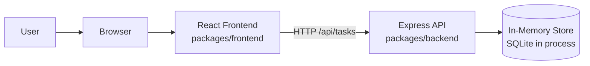
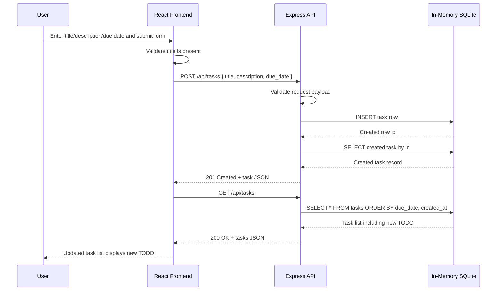

# Cloud Architecture Overview

This document provides a simple system context view of the TODO monorepo architecture.

## System Context Diagram

## Sequence Diagram: Create TODO

## Notes

- The frontend runs as a React application and calls the backend over HTTP.
- The backend runs as an Express API.
- Data is stored in an in-memory SQLite database, so data resets when the backend process restarts.
